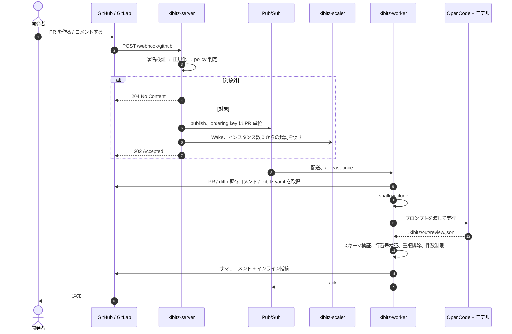
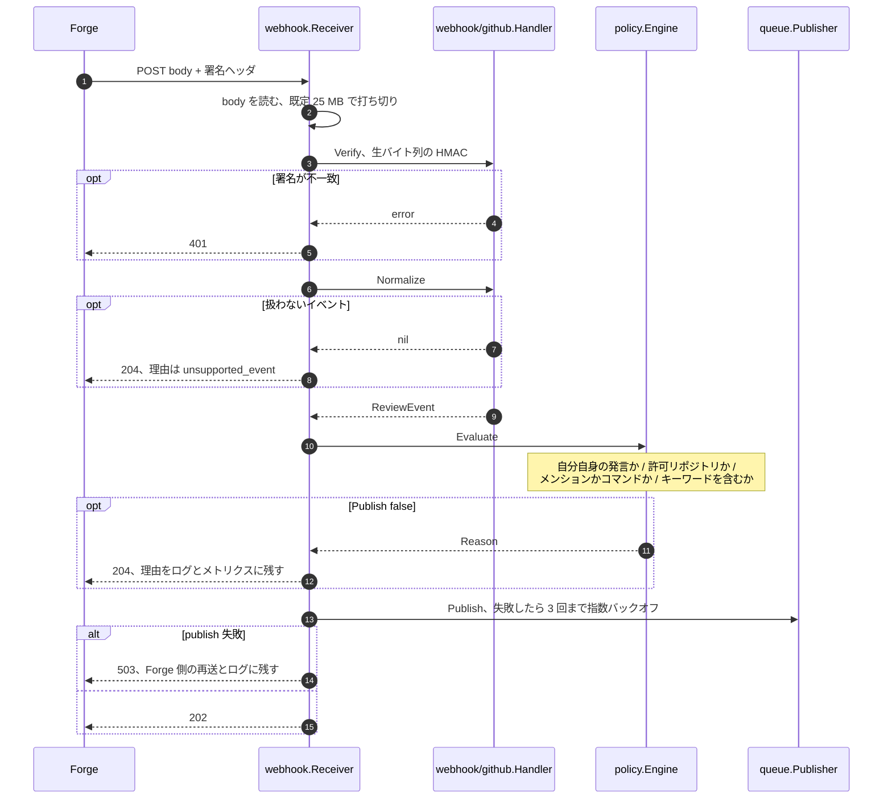
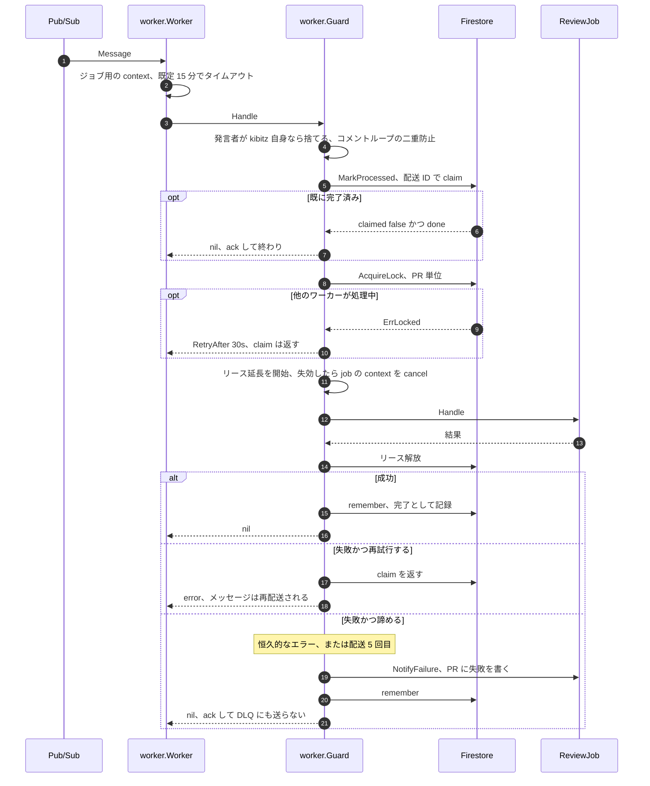
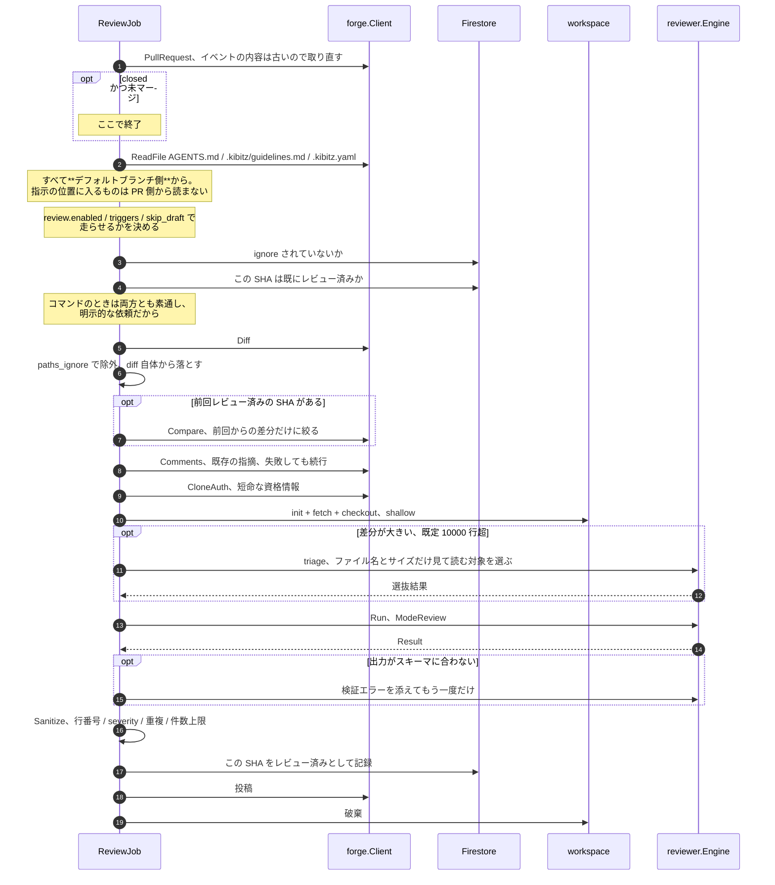
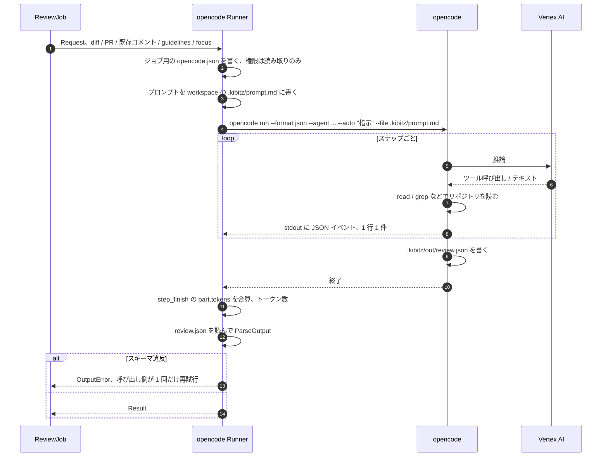
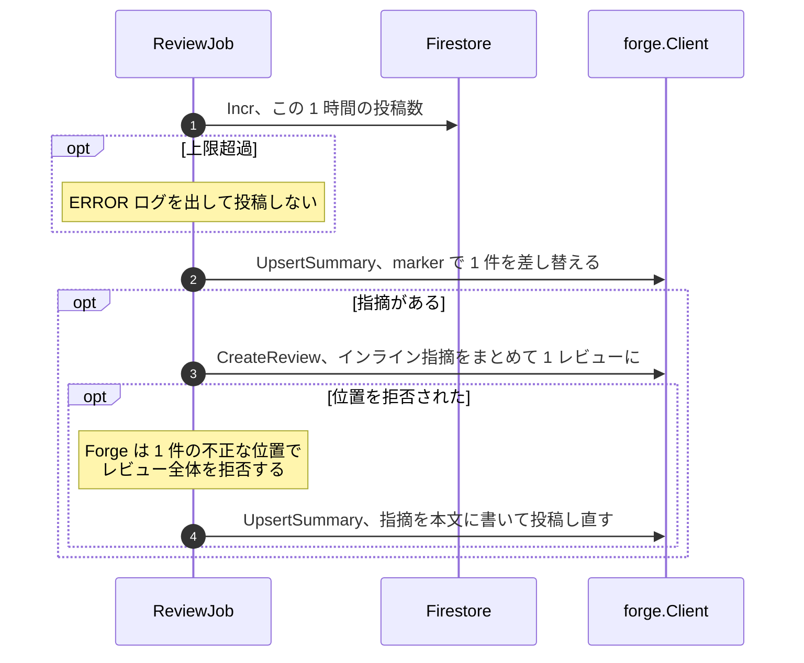
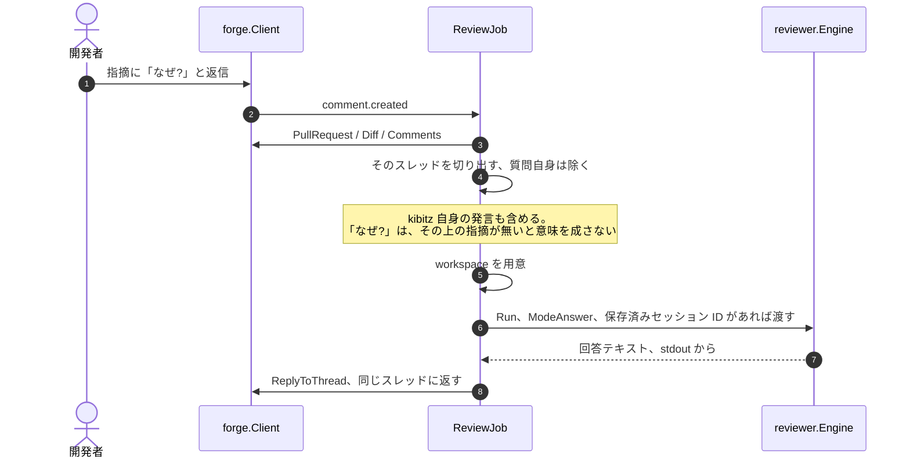
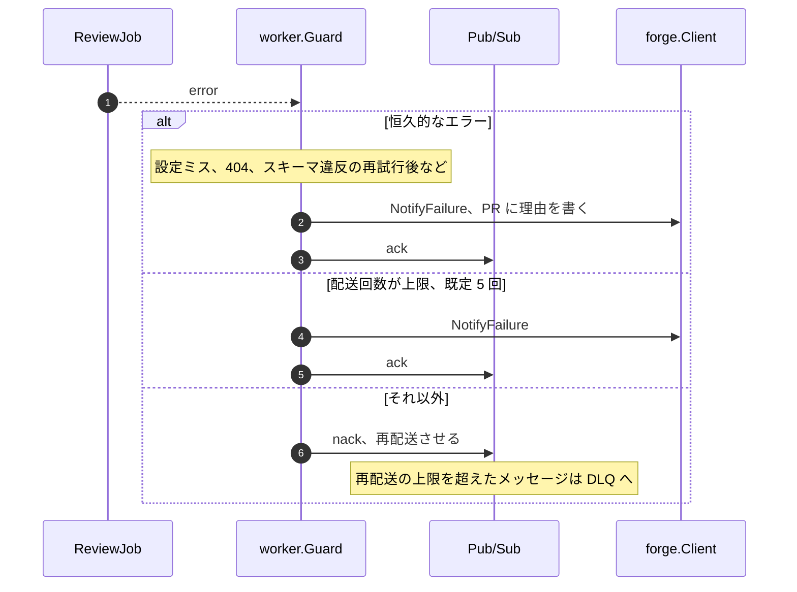

# レビュー処理の流れ

Webhook が届いてからレビューコメントが付くまでに、何がどの順番で起きるか。
「なぜレビューされなかったのか」を追うときの地図でもある。

コンポーネントの役割分担は [architecture.md](architecture.md)、
キューの詳細は [queue.md](queue.md)、
エージェントの実行方法は [worker.md](worker.md) を参照。

> 図は Mermaid で書いてある。GitHub 上ではそのまま図として表示される。

## 1. 全体

Webhook の応答は**数秒以内に返さないと Forge 側がタイムアウトする**のに対して、
レビューは数分かかる。そのため境界はキューにあり、サーバーは
「検証・正規化・判定・publish」だけをして 202 を返す。

`Wake` を別に送っているのは、pull 購読にはオートスケールの根拠になる
inbound リクエストが無いため。バックログのメトリクスは数分遅れるので、
それを待つとレビューの開始が遅れる ([deployment.md](deployment.md#ワーカーのオートスケール))。

## 2. サーバー側 — 検証から publish まで

順番に意味がある。**検証は生のバイト列に対して、パースより前に**行う。

判定理由 (`policy.Reason`) はログにもメトリクスのラベルにも出る。
「なぜレビューされなかったのか」に答えられるようにするため
([event-schema.md](event-schema.md))。

publish 失敗に 503 を返すのは、**GitHub が自動で再送しないから**。
せめて hook の delivery log に失敗として残し、手動の Redeliver ができるようにする。

## 3. ワーカー側 — Guard

キューは at-least-once なので、同じメッセージが 2 回来る前提で組んである。
`worker.Guard` がその面倒を引き受け、実際のレビューは `ReviewJob` が見る。

諦めるときに ack するのは、**同じ失敗を 5 回繰り返しても結果は変わらない**から。
代わりに PR に理由を書く。黙って消えるのが一番困る。

リースが失効したら job の context を cancel するのは、
2 つのワーカーが同じ PR を同時にレビューするのを防ぐため。

## 4. レビュー本体

`ReviewJob.review()`。**安い判定から順に並べてある**ので、
やらないと決まる場合ほど早く終わる。

要点:

- **イベントの内容を信用しない。** Webhook が飛んだ時点のスナップショットは
  ジョブが動く頃には古い。Azure DevOps では署名が無いのでそもそも信用できない
- **`.kibitz.yaml` はデフォルトブランチから読む。** PR 側から読むと、
  PR を開いた人がその PR のレビューのされ方を決められてしまう
  ([security.md](security.md))
- **`paths_ignore` は diff そのものに効かせる。** 指摘の検証も同じ diff で行うので、
  エージェントが除外ファイルを読んで指摘してきても投稿されない
- **増分レビューは差分を絞るだけ。** 指摘の行番号は常に PR 全体の diff に対して
  検証するので、範囲外にコメントが付くことはない
- **triage は名前とサイズしか見ない。** 中身まで読んだら、節約するはずのものを使ってしまう

### スキップの判断順序

上から順に見て、最初に当たったところで終わる。理由はログに残る。

| 判定 | 場所 | コマンドのとき |
| --- | --- | --- |
| 自分自身の発言 | server の policy → worker の Guard (二重) | 同じく捨てる |
| リポジトリが許可リストに無い | server の policy | 同じく捨てる |
| メンションもコマンドも無い | server の policy | — |
| タイトル / 本文にキーワードが無い | server の policy | 素通し |
| PR が closed かつ未マージ | `review()` | 同じくスキップ |
| `review.enabled` が false / `triggers` に無い | `review()` | `triggers` は素通し |
| draft かつ `skip_draft` | `review()` | 素通し |
| `/kibitz ignore` されている | `review()` | `review` が解除する |
| この SHA はレビュー済み | `review()` | 素通し |
| 差分が空、または全ファイルが `paths_ignore` | `review()` | 同じくスキップ |
| 1 時間の投稿数上限、既定 10 | `post()` | 同じく止まる |

最後の投稿数上限だけは、**コマンドでも解除されない**。
コメントループに対する最後の防波堤なので、ここで止まるときは ERROR でログに出す。

## 5. エージェントの実行

`reviewer/opencode`。CLI をヘッドレスで叩き、**結果はファイルで受け取る**。
stdout のテキストをパースするより堅い。

- `--file` は配列オプションなので**必ず最後に置く**。
  後続の引数まで添付ファイル名として食われる
- トークン数は `step_finish` イベントの `part.tokens` にしか無く、
  しかもステップごとの値なので合算が必要
  ([worker.md](worker.md#stdout-の-json-イベント))
- セッションが消えていたら、セッション無しでもう一度実行する。
  ワーカーのコンテナは使い捨てなので、消えているのは異常ではない

## 6. 投稿

サマリを upsert にしてあるので、同じ PR を何度レビューしてもサマリは 1 件のまま。
`<!-- kibitz:summary -->` のような marker で自分のコメントを見つける。

## 7. 質問への回答

コメントがメンションを含み、コマンドでなければ質問として扱う。

セッションの継続は**最適化**として実装してある。ワーカーのコンテナは使い捨てで、
レビューと追質問の間に消えていることが多いため、文脈はセッションではなく
毎回プロンプトに入れる ([worker.md](worker.md))。

## 8. 失敗したとき

再試行するかどうかは `internal/worker/errors.go` の分類による。
「何度やっても同じ」ものを再試行しても、レートリミットを消費するだけで結果は変わらない。

エラー分類と実際の再試行回数、DLQ に入る条件は [queue.md](queue.md#6-エラー分類)。

## 関連

| ドキュメント | 内容 |
| --- | --- |
| [architecture.md](architecture.md) | コンポーネントの役割、インターフェース定義 |
| [event-schema.md](event-schema.md) | 正規化イベント、publish の判定条件 |
| [queue.md](queue.md) | 順序制御、冪等性、リトライ、DLQ |
| [worker.md](worker.md) | プロンプト設計、OpenCode の実行、構造化出力 |
| [configuration.md](configuration.md) | 環境変数、`.kibitz.yaml` |
| [security.md](security.md) | 署名検証、プロンプトインジェクション、fork PR |
