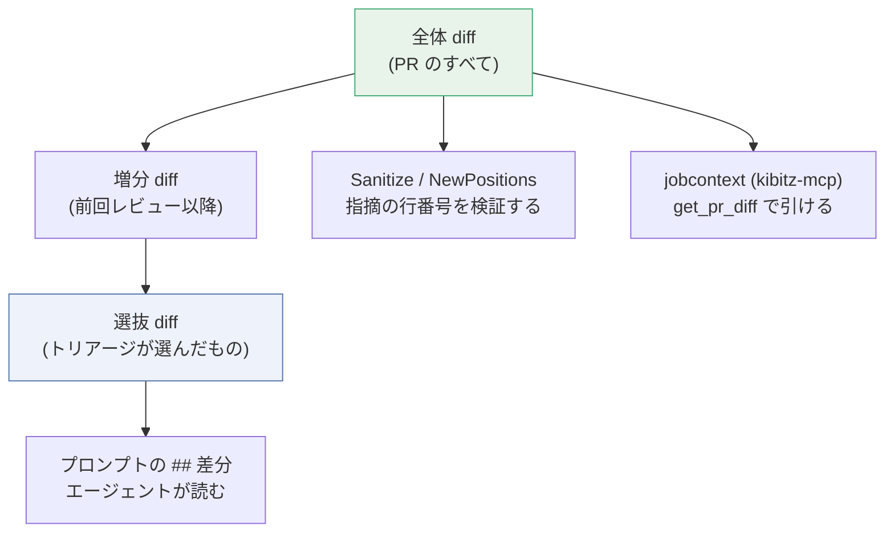

# トリアージ: 大きすぎる変更を絞る

10 万行の差分はプロンプトに入らない。そして**入らないと分かるのは、1 回分の実行を使い切った後**である。

トリアージは、その前に走る **1 回目のパス**である。
変更ファイルの**一覧だけ**を読んで、どれをレビューする価値があるかを選ぶ。

実装は `internal/worker/triage.go`、プロンプトは `internal/reviewer/prompt.go` の
`buildTriagePrompt`、出力の契約は `internal/reviewer/triage.go`。

## 1. いつ動くか

`ReviewJob.triage` の入口で、次のどちらかに当たったときだけ走る。

| 条件 | 意味 |
| --- | --- |
| `diff.Lines() > KIBITZ_MAX_DIFF_LINES` | 増減行数の合計が上限 (既定 10,000) を超えた |
| `diff.Truncated` | **プラットフォーム側**が差分を打ち切った (ファイル数上限など) |

どちらでもなければ、差分はそのまま素通りする。トリアージのパスは走らず、費用も発生しない。

**トリアージを止める設定は無い。** `KIBITZ_MAX_DIFF_LINES` は 0 以下を受け付けず、
指定すると**ワーカーが起動時に落ちる**。

```
KIBITZ_MAX_DIFF_LINES: must be greater than 0, got 0
```

`triage()` の先頭にある `j.MaxDiffLines <= 0` の分岐は、
設定を経由せずに `ReviewJob` を組み立てた場合 (テストなど) のためのもので、
デプロイされた構成では通らない。トリアージを避けたいなら**上限を上げる**。

`Truncated` が条件に入っているのは、行数が上限以下でも**一覧そのものが不完全**なことがあるため。
このときプロンプトには「この一覧は打ち切られています」と明記され、
選ぶ側もそれを前提に判断する。

## 2. 3 つの diff

ここがトリアージで一番分かりにくいところで、**差分が 3 つある**。
それぞれ役割が違い、混ぜると壊れる。

| | 何 | 作られる場所 |
| --- | --- | --- |
| **全体** (`diff`) | PR の差分すべて。`paths_ignore` 適用後 | `client.Diff()` |
| **増分** (`changed`) | 前回レビューした SHA から今回までの差分 | `j.incremental()` |
| **選抜** (`selection.Diff`) | 増分のうち、トリアージが選んだファイルだけ | `j.triage()` |

三段階で狭まる。**全体 ⊇ 増分 ⊇ 選抜。**

そして、狭める先が消費者ごとに違う。



**読む範囲を狭めることが、コメントしてよい範囲を広げてはいけない。**
だから指摘の位置検証は、選抜後ではなく**常に全体の diff**に対して行う
(`reviewer.Sanitize(result.RawOutput, reviewer.NewPositions(diff), ...)`)。
エージェントが選から漏れたファイルについて何か言ってきても、
それは差分の中の行を指していれば通るし、指していなければ落ちる。判定基準は変わらない。

同じ理由で、`kibitz-mcp` に渡す jobcontext は**全体の diff** を持つ
([ADR-0016](adr/0016-kibitz-mcp-holds-no-credential.md))。
プロンプトには 10 ファイルしか載っていなくても、
**11 個目が気になったエージェントは `get_pr_diff` で読める**。
トリアージは「プロンプトに載せるものを選ぶ」のであって、
「読めるものを減らす」のではない。

## 3. トリアージのパスが見るもの

プロンプトに載るのは 3 つだけ。

1. 選び方の指示
2. プルリクエストのタイトルと説明 (`<<<` `>>>` で囲まれたデータ)
3. **変更ファイルの一覧** — パス、状態、増減行数

```
## 変更ファイル (312 件, 84201 行)

| ファイル | 状態 | +/- |
| --- | --- | --- |
| `internal/queue/sqs/subscriber.go` | modified | +180/-12 |
| `internal/store/dynamodb/store.go` | added | +640/-0 |
| `go.sum` | modified | +1204/-1180 |
| `web/dist/bundle.js` | modified | +41000/-39000 |
```

**patch は 1 行も載らない。**

これは省略ではなく、機能の前提である。
差分を読むパスは、**節約しようとしているものをそのまま使ってしまう**。
プロンプトにも「ファイルの中身を読む必要はない。名前と変更量から判断してよい」と書いてある。

選び方の指示は 4 つ。

- 壊れたときの影響が大きいもの、正しさやセキュリティに関わるものを優先する
- 生成物、ロックファイル、vendor、スナップショット、大量の定型的な変更は後回しにする
- ファイルの中身を読む必要はない
- **判断に迷うものは含める。見落とすより読みすぎるほうがよい**

最後の 1 つが、この機能全体の非対称性を表している。
**読みすぎはコストだが、読まなすぎはバグの見逃しである。**

## 4. 出力の契約

`.kibitz/out/triage.json` に書かせる。レビューの出力 (`review.json`) とは**別のファイル**で、
トリアージの実行が「何も見つからなかったレビュー」と取り違えられないようにしてある。

```json
{
  "schema_version": 1,
  "paths": ["internal/queue/sqs/subscriber.go", "internal/store/dynamodb/store.go"],
  "notes": "生成物とロックファイルを除外しました"
}
```

`ParseTriage` が検証する。

| 検査 | 失敗したら |
| --- | --- |
| JSON として妥当か | `OutputError` |
| `schema_version` が一致するか | `OutputError` |
| 空白を除いた `paths` が 1 件以上あるか | `OutputError` |

`notes` は任意で、**作者に見せる**。
半分飛ばしたことを黙っているよりは、理由を書いてあるほうがよい。

## 5. 選定の検証

`selectFiles` が、選ばれたパスを**差分と突き合わせる**。

- **差分にあるファイルだけを残す。** エージェントが作り出したパスは無視する。
  何を読むかを選ぶことが、**何を読めるかを広げてはいけない**
- 残す順序は**差分が元々持っていた順**。選ばれた順ではない
- リネームは `PreviousPath` でも一致する (旧名で指してきても拾える)
- 選ばれなかったものは `Skipped` に入り、**名前がサマリコメントに出る**

## 6. 全体レビューに戻る経路

**絞れない経路はすべて全体に落ちる。** 一つも例外がない。

| 何が起きたか | 結果 | ログ |
| --- | --- | --- |
| 差分が上限以下かつ打ち切られていない | 全体 | なし (そもそも走らない) |
| エージェントがエラーで落ちた | 全体 | `triage failed; reviewing the whole change` |
| 結果が `nil` / `Triage` が `nil` | 全体 | 同上 |
| 出力がスキーマに合わない | 全体 | 同上 (`OutputError` として届く) |
| 選定が差分と**1 件も**一致しなかった | 全体 | `triage selected nothing that is in the diff` |

**失敗しても全体をレビューしに行く**ので、トリアージはレビューを止めない。
上限を超えた差分を 1 回で投げることになるが、
それは**トリアージが無かったときの挙動**であって、悪化ではない。

なお、エラーで落ちた場合も**そこまでに使ったトークンは計上する** (`usageOf`)。
使ったものは使った。

## 7. 費用

トリアージを使ったレビューは、**モデルを 2 回呼ぶ**。

```go
j.writeUsage(&b, result.Usage.Add(selection.Usage), settings.Model)
```

`reviewer.Usage.Add` があるのはこのためで、
サマリコメントの「トークン: 入力 … / 出力 …」には**両方のパスの合計**が出る。
片方だけ出すと、見ている人には安く見える。

使うモデルは `KIBITZ_TRIAGE_MODEL`。未設定ならレビューと同じモデル
(`.kibitz.yaml` の `review.model` → `KIBITZ_MODEL`)。
**ファイル名を読むだけの仕事に高いモデルは要らない** ([ADR-0013](adr/0013-narrow-what-is-reviewed-and-report-the-cost.md))。

## 8. 作者に見えるもの

絞ったときだけ、サマリコメントに出る。

```markdown
指摘: 6 件

変更が大きいため、12 件のファイルを選んでレビューしました (残り 300 件は未レビュー)。

生成物とロックファイルを除外しました

<details><summary>レビューしなかったファイル</summary>

- `go.sum`
- `web/dist/bundle.js`
  …
</details>
```

**黙って半分を飛ばしたレビューは、レビューが無いより悪い。**
「指摘なし」と「読んでいないので指摘が無い」は、読む人にとってまったく違う。

## 9. 意図的に渡していないもの

| | 理由 |
| --- | --- |
| **差分の中身 (patch)** | 節約しようとしているものを使ってしまう |
| **MCP サーバー** | ツール定義はリクエストのたびにトークンを食う。Jira を引くパスは、節約のためのパスではない ([ADR-0015](adr/0015-mcp-declared-in-three-layers-off-by-default.md)) |
| **`kibitz-mcp`** | 同上。`ContextBin` があっても、トリアージには登録しない |
| **設計文書 (ADR) の索引** | 索引は `ModeReview` / `ModeAnswer` のプロンプトにしか載らない |
| **既存コメント / 規約ファイル** | 読むファイルを選ぶ判断に要らない |

エージェント定義は `KIBITZ_OPENCODE_TRIAGE_AGENT` (既定 `kibitz-triage`)。
権限はレビューと同じ読み取り中心のものが当たるが、
**そもそもファイルを読む必要がない仕事**として指示されている。

## 10. 調整するとき

| 症状 | 見るところ |
| --- | --- |
| 大きい PR で毎回 2 回呼ばれて高い | `KIBITZ_MAX_DIFF_LINES` を上げる。モデルのコンテキストに収まる範囲で。**0 にはできない** (起動エラー) |
| トリアージが大事なファイルを落とす | `KIBITZ_TRIAGE_MODEL` が安すぎないか。プロンプトの「迷うものは含める」が効いているか |
| 生成物が毎回選ばれる | `.kibitz.yaml` の `paths_ignore` で**差分から消す**ほうが確実。トリアージに毎回判断させるより安い |
| トリアージが毎回失敗する | ログの `triage failed; reviewing the whole change` の `error`。モデル ID とスキーマ検証を疑う |

うまくいった場合のログは 2 行。

```
the change is too large to review in one pass; triaging  lines=84201 limit=10000 files=312
triage selected the files to review  selected=12 skipped=300 lines=3980 input_tokens=8100 output_tokens=210
```

絞れずに全体へ落ちた場合は、代わりに warn が 1 行出る
(`triage failed; ...` または `triage selected nothing that is in the diff; ...`)。

レビュー本体のログにも `files_reviewed` と `files_skipped` が並ぶので、
**絞った結果が 1 行で読める**。

## 関連

- [worker.md](worker.md#巨大な-pr-の-triage) — ワーカー全体の中での位置づけ
- [review-flow.md](review-flow.md) — シーケンス図
- [ADR-0013](adr/0013-narrow-what-is-reviewed-and-report-the-cost.md) — レビュー範囲を絞る 3 つの方法と、その判断
- [ADR-0016](adr/0016-kibitz-mcp-holds-no-credential.md) — 選から漏れたファイルを後から読めるようにした理由
